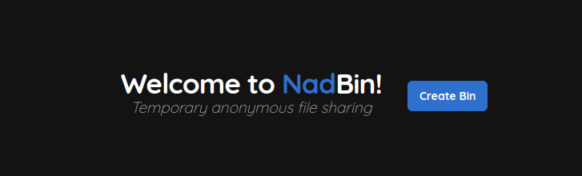

Temporary anonymous file sharing

**NadBin is still in development and not ready for production use.**  
And the code is very shitty, I'm working on it, I promise :D

## Why NadBin?

- Extremely easy to setup
- Direct downloads without redirects
- Very lightweight (at least on the client side)



## Setup

### Requirements

- Java 8+

### Install & Run

- Download the latest release from the [releases page](https://github.com/Nadwey/NadBin/releases/latest)
- Run the jar file with `java -jar NadBin-<VERSION>-all.jar`
- The server will be available at `http://localhost:7000`

### Webserver configuration

#### Caddy

```caddy
example.com {
        reverse_proxy localhost:7000
}
```

#### Nginx 

```nginx
server {
        listen 80;
        listen [::]:80;

        server_name example.com; # your domain

        # redirect to https
        return 301 https://$host$request_uri;
}

server {
        listen 443 ssl http2;
        listen [::]:443 ssl http2;

        client_max_body_size 10000M; # max file size that is accepted by Nginx

        server_name example.com; # your domain

        sendfile           on;
        sendfile_max_chunk 10m;

        ssl_certificate /path/to/your/cert.pem;
        ssl_certificate_key /path/to/your/privkey.pem;

        location / {
                proxy_pass http://localhost:7000;
        }

        # disable logging
        access_log off;
        error_log /dev/null;
}
```
